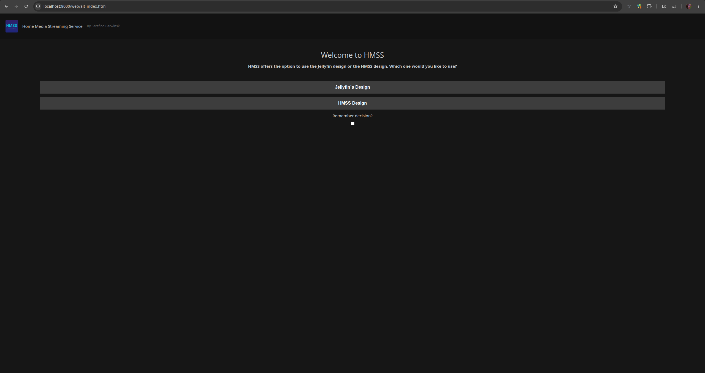
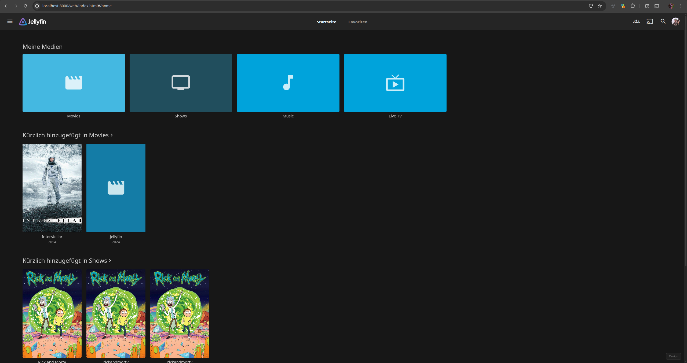

# HMSS — Home Media Streaming Service

A Jellyfin-compatible media streaming server you can host yourself. Built from the
ground up in Node.js — no C#, no .NET, no legacy baggage.

**Status: Alpha.** Core functionality works — authentication, media browsing,
metadata enrichment, artwork, and streaming all operational. More features
coming steadily. Contributions and feedback welcome.


*There are also pictures and a video at the very bottom.*


## Why?

Running your own media server is awesome. But existing solutions can be
frustrating — they're often hard to set up, opaque when things go wrong, or
slow to fix issues that matter to self-hosters.

HMSS takes a different approach: a fresh codebase in Node.js, designed to be
easy to read, easy to modify, and easy to run. It speaks the Jellyfin API so
your favourite clients (Findroid, Jellyfin Mobile, etc) just work — but
the server itself is diffrent from top to bottom.

## Requirements

- **Node.js** 20 or later
- **ffmpeg** in your PATH
- **TMDB API Key** (free at [themoviedb.org](https://www.themoviedb.org/settings/api))
- **Fanart.tv API Key** (free at [fanart.tv](https://fanart.tv/get-an-api-key/))

That's it. No Docker required (but it runs fine in one).

## Optional

- **[Telerising API](https://github.com/sunsettrack4/telerising-api)** — LiveTV
  integration. Provides IPTV channel streaming through various providers.
  Place the ZIP Content at `src/telerising` and configure via the web dashboard.
  Then under **Live TV → Tuner Hosts** (type: M3U, URL:
  `http://localhost:5000/api/{provider}/live/channels.m3u?ffmpeg=true`).

## Quick Start

```bash
git clone https://github.com/SerafinoBarwinski/HMSS.git
cd HMSS
npm install
npm start
```

The server starts on port 8000. Open `http://localhost:8000` in a browser or
connect with Findroid / Jellyfin Mobile.

On first start, the Setup Wizard guides you through creating the admin account
and configuring server settings.

## Addon Configuration

API keys for metadata and artwork are configured through addon override files.
Each addon in `src/addons/` has a `config.json` (schema + defaults) and an
`override.json.example` (copy to `override.json` and fill in your keys).

You can also configure addons directly through the **Jellyfin Web Dashboard**:
go to **Dashboard → Plugins**, click on an addon, edit its settings, and save.

**TMDB** (metadata for movies and shows):
```
src/addons/tmdb/override.json
```
```json
{ "api_key": "your-tmdb-api-key" }
```

**Fanart.tv** (posters, backgrounds, logos):
```
src/addons/fanart_tv/override.json
```
```json
{ "api_key": "your-fanart-tv-key" }
```

**MusicBrainz** works out of the box — no API key needed.

## Media Setup

Drop your files into the `media/` directory using this structure:

```
media/
  movie/$group/$movie/video.mp4
  shows/$show/$season$episode/video.mp4
  music/$artist/$album/track.m4a
```

The server scans these folders on startup. Metadata (`meta.yaml`) is written
automatically. With API keys configured, HMSS fetches cover art, descriptions,
and posters from TMDB and Fanart.tv.

## What Works

- **Authentication**: Password login, Quick Connect, Setup Wizard, sessions
- **Media Browsing**: Full Jellyfin-compatible item listing, filtering, suggestions
- **Media Playback**: Direct play streaming with Range support (seeking works)
- **Live TV**: Telerising IPTV integration — channel listing, HLS proxy streaming, channel logos
- **Metadata Enrichment**: TMDB (movies/shows), MusicBrainz (music), Fanart.tv (artwork)
- **Addons**: Plugin system with config UI in Jellyfin Web Dashboard
- **Media Scanning**: Threaded background scanning with metadata extraction (ffprobe)
- **jellyfin-web**: Full web UI hosted, works with Jellyfin Mobile app
- **Discovery**: UDP on port 7359, WebSocket for real-time updates
- **Localization**: Languages, cultures, countries served from API
- **System Info**: Server info, ping, logging, activity log, disk stats
- **Rate Limiting**: Per-IP request throttling, localhost exempt
- **Spam Protection**: Configurable IP-based request limiting

## What's Next

- HMSS-native frontend
- XMLTV / EPG guide data

## API Compatibility

HMSS implements a large subset of the Jellyfin API. Most endpoints used by
Jellyfin Mobile, and other clients are functional.


**HMSS is not affiliated with or endorsed by the Jellyfin project. We implement
API compatibility to leverage the existing ecosystem of clients.**

## License

GPL v2 — see [LICENSE](LICENSE).

## Medias
*Looks like regular Jellyfin* but is faster

*GITHUB TELL ME WHY CANT I EMBED VIDEOS!*
[Watch Demo](.github/media/screen-20260724-223252-1784925150692.mp4)


